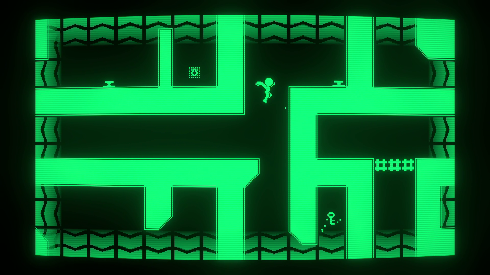
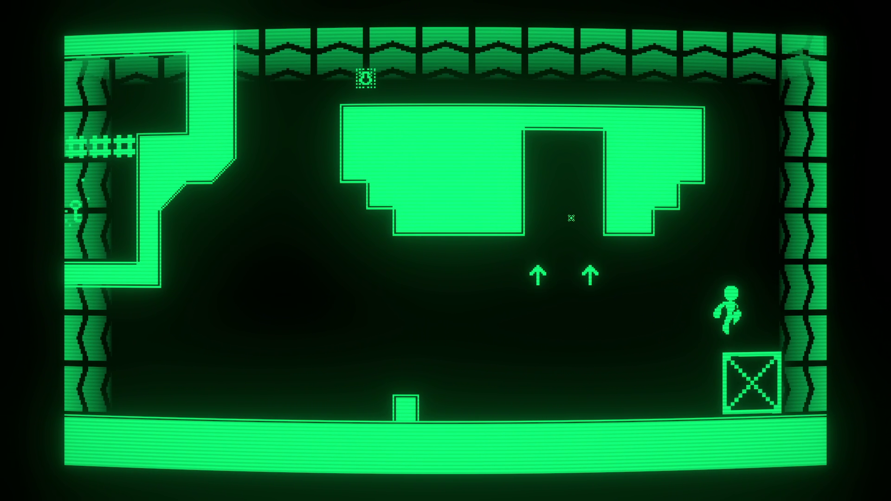
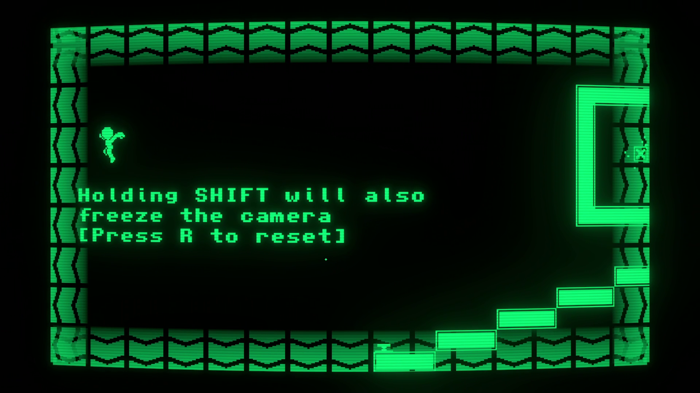

*Overflow.SYS* is a 2D puzzle platforming game created in 96 hours for the [*GMTK Game Jam 2025*](https://itch.io/jam/gmtk-2025). In this game, you control a character that can loop across the edges of the screen. 

In this game, I programmed the platforming physics, the warping code, and all the rest of the features that can be placed in levels. I also modified a character template asset to use as the visuals for the player, and drew the tileset for the game in Aseprite. The other 2 programmers I worked with created the levels, music, sounds and UI of the game, among other things.

Out of all 9,515 entries to the game jam, our game placed 95th in the Enjoyment category, putting Overflow.SYS in the top 1% of most enjoyable games in the jam! Other notable placements include #525 in Creativity and #664 in Audio.

The game is fully playable on web browser [here](https://jackachulian.itch.io/overflow)!

