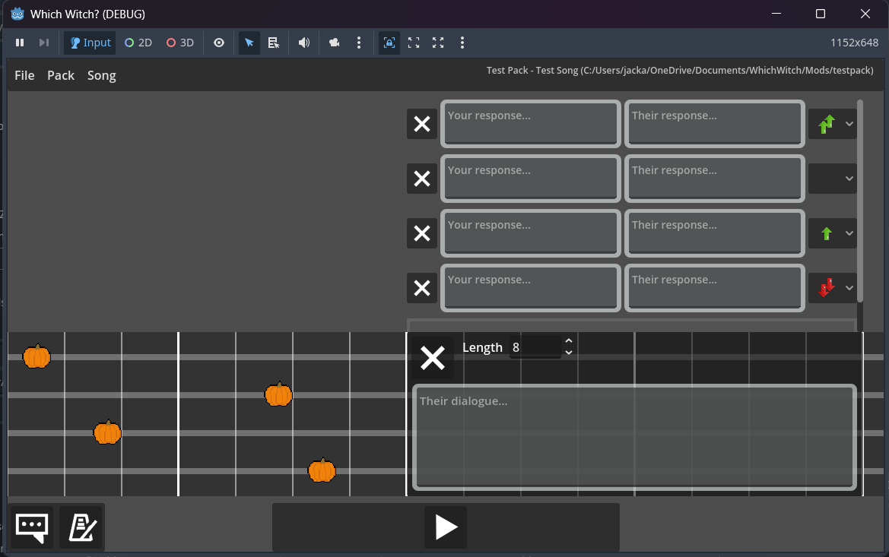
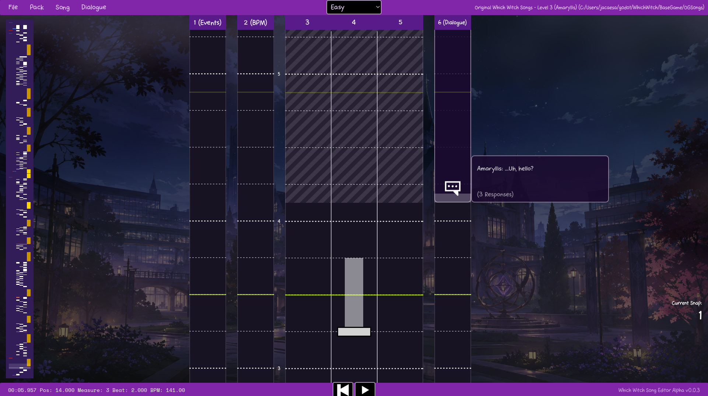
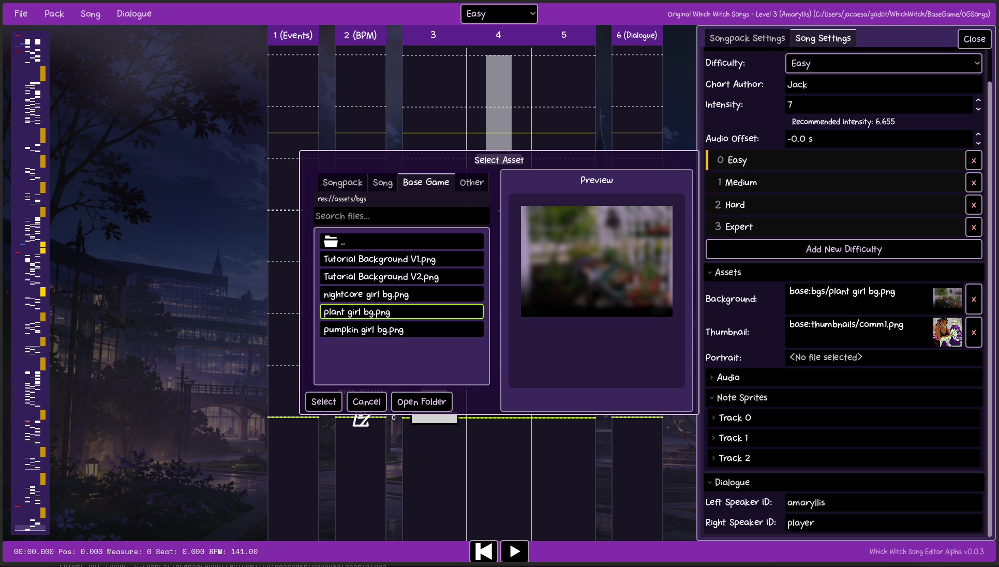
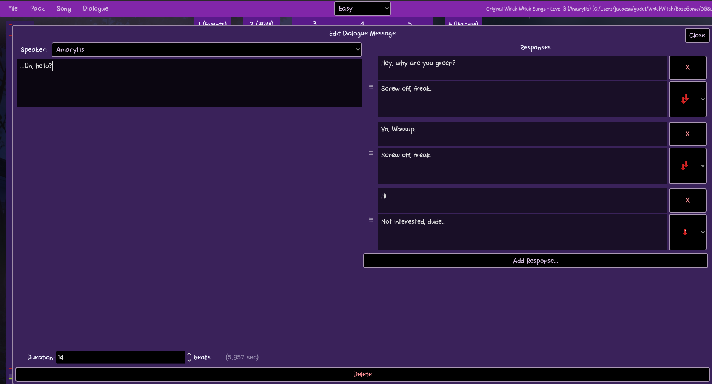
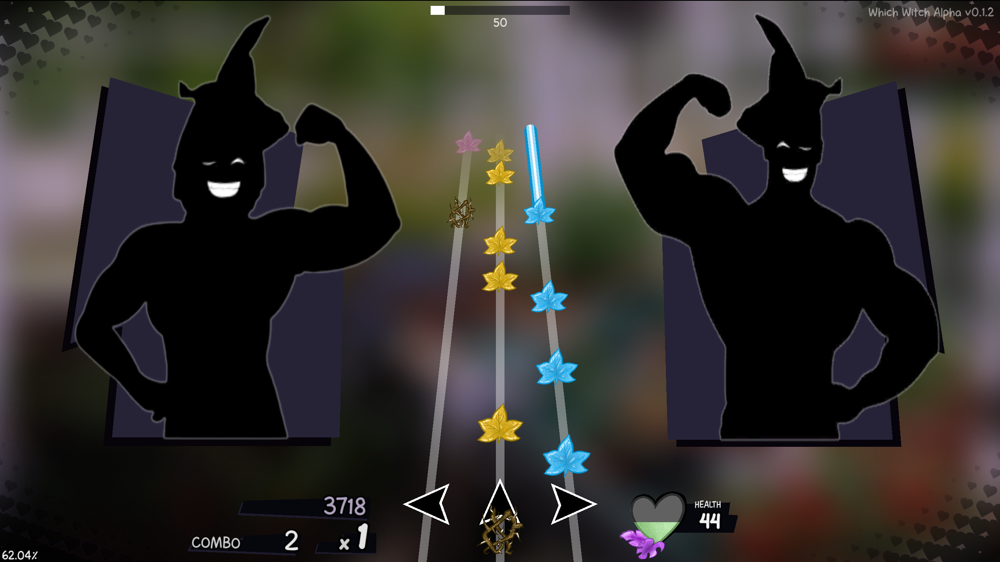
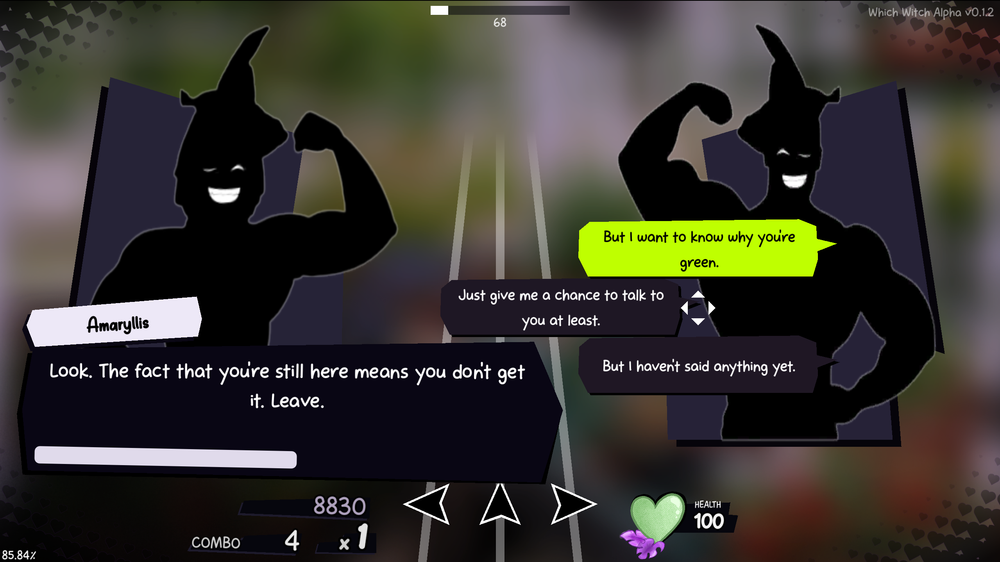
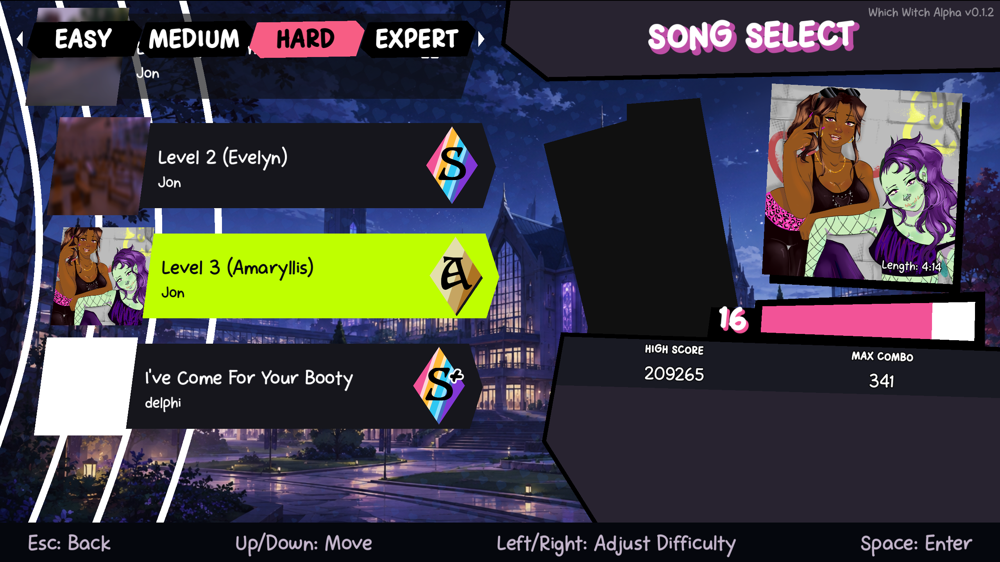

*Which Witch?* is a rhythm game and a visual novel / dating sim all combined into one. I created the song chart editor program, and programmed many parts of the main rhythm game scene as well.

## Editor

Our game is highly focused on user-generated content, so we wanted to make our editor highly accessible, and not just be an afterthought or have UI that only the developers would know how to use.

Here is a screenshot of the first iteration of our editor program:

However, one of our big concerns was that the dialogue was not as prominent as it could be, and deserves its own dedicated editing window. Due to this as well as generally the editor having some messy code, we decided to rewrite the entire editor UI from scratch. The new code follows best Godot practices, using function calls to communicate down to child nodes, and using signals to communicate up to parent nodes. Here are some screenshots of the newly updated editor, which now scrolls from bottom-to-top instead of left-to-right (the same direction notes travel in-game). Dialogue is displayed beside the note tracks, but has its own dedicated editing window when clicked. 

Later on when the dialogue system is more advanced, this dialogue edit window will feature a full node-based system to give players functionality to change dialogue portraits, move characters around the screen, and more.





## FMOD Engine

[FMOD](https://www.fmod.com/) is an audio middleware that allows a high degree of control over audio effects and provides a dedicated workspace for audio to live in. FMOD Studio is used to edit these sounds and is entirely separate from the codebase of the game, making it easy to play back and engineer audio effects without our codebase interfering. In order to interface closely with FMOD, we created a custom build of the Godot Engine that has a module that can communicate directly with the low-level C++ FMOD Core API.

Here are some of the things FMOD allows us to do:

- Parameters, settable via code, that can influence event playback from outside FMOD Studio
- Horizontally dynamic audio, ex. transitioning into a different loop after a certain loop is finished
- Vertically dynamic audio, ex. fading the volume of certain instruments in a song over time
- Automatable effects, such as reverb, echo, delay, and EQ
- Reading DSP buffer data to create an audio waveform preview in the song editor
- Reading the DSP clock data of event to allow for ultra-precise rhythm gameplay

## Song Folder Structure

We wanted to focus on making our song folders easy to read/modify by users. We also wanted a high degree of security to prevent users from injecting malicious/unwanted content into the game. We decided to structure our song folder as follows:
```txt
Song-Folder
\ data.json - stores metadata, assets paths (song thumbnail, etc), and more
\ dialogue.json - stores dialogue messages / dialogue prompts in JSON format
\ 0.song - notes and BPM ranges for difficulty 0 of the song
\ 1.song - notes and BPM ranges for difficulty 1 of the song, etc...
```

Here is an example what a .song file may look like:
```
[metadata]
# The difference between the audio playback position and the song's notemap position, 
# for precise audio synchronization
offset=-0.00015830004122

[bpms]
0.0,141.0,100.0,180.0,4
372.0,177.0,100.0,180.0,4
632.0,88.5,88.5,180.0,4

[notes]
0.0,0,hold,3.0
5.0,1,hold,2.0
35.0,2,tap
37.0,0,tap
...
```
.song files are text-based and easy to debug. They can be automatically compiled into .songbin files automatically by the engine, converting them to a lightweight binary format. This reduces filesize and load time for levels.

## Validation

Which Witch's songs undergo a rigorous validation process before they are allowed to be loaded into the game. Because users will be able to upload songs for other players to play, it is highly important to verify with a high degree of certainty that a song is setup correctly and will not cause the game to do anything unexpected or expose any security vulnerabilities.

When a song is loaded in the game, relevant JSON files are scanned to ensure they have the required key and that its value is the expected type. *Schemas* can be defined in the code and passed into the **_validate_schema** function with a JSON object and the schema to test it against.

```python
const manifest_schema: Dictionary = {
	"type": TYPE_DICTIONARY,
	"rules": {
		"editor_version": { "type": TYPE_STRING, "optional": true },
		"display_name": { "type": TYPE_STRING, "max_length": 80 },
		"author": { "type": TYPE_STRING, "max_length": 80 },
		"description": { "type": TYPE_STRING },
		"songs": {
			"type": TYPE_ARRAY,
			"value": { # "value" specifies the expected data type inside an array
				"type": TYPE_STRING,
				"songpack_subfolder_name_exists": true,
			}
		}
	}
}
```

## Gameplay

A lot of the gameplay code was written by our other programmer (Brandon), but I was still heavily involved with the creation and debugging of this code, along with several of the UI elements (many of which were simply created using Godot's Polygon2D node).

Our game combines fact-paced rhythm gameplay with dialogue that passes by quickly. Players are expected to act quickly and choose dialogue choices that they think won't pester the person they're talking to much - if they choose a bad dialogue option, their notes speed up and the rhythm gameplay becomes more difficult!



